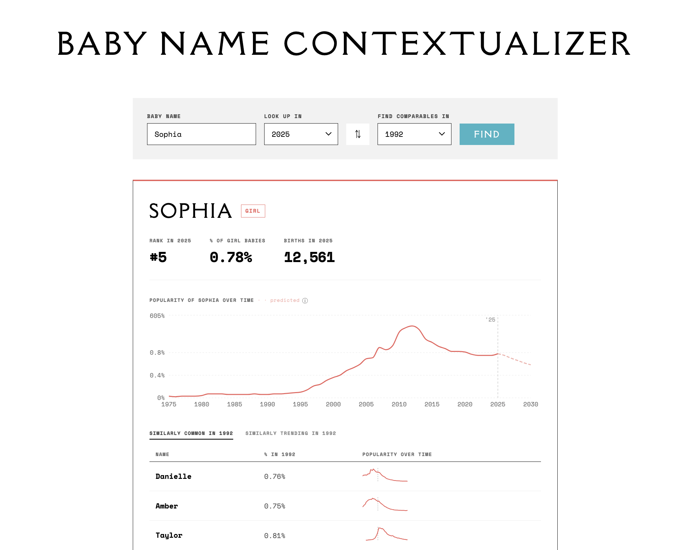

# [Baby Name Contextualizer](https://babynamecontextualizer.com)



A tool for understanding what a baby name *meant* in a given year — not just how popular it was, but what other names it was running alongside, and where it might be headed.

Built with React + Vite. Data from the [U.S. Social Security Administration](https://www.ssa.gov/oact/babynames/).

## What it does

Enter a name, a year to look it up in, and a year to find comparables in. The app shows:

- **Rank, count, and percentage** of babies given that name in the lookup year
- **Similarly Common** — names that were equally popular in the comparison year, giving cultural context ("Jennifer in 1985 was a Taylor-in-2015 kind of name")
- **Similarly Trending** — names whose popularity *trajectory* over the preceding 15 years most closely matched, capturing momentum and vibe beyond raw rank
- **Prediction** — a 5-year popularity forecast based on historical analogues (names that followed a similar arc in the past and how they played out)

Comparison names are clickable. Happy exploring!

## Running locally

```bash
npm install
npm run dev
```

The name data (`public/data/girls.json` and `boys.json`) is committed to the repo, so no data processing step is needed to get started.

## Data pipeline

The JSON files are generated from the SSA baby names zip file:

```bash
npm run process-data
```

The SSA blocks automated downloads, so the zip has to be downloaded manually from [ssa.gov/oact/babynames/limits.html](https://www.ssa.gov/oact/babynames/limits.html) and placed in the right folder before running the script. The processed files cover the top 1,000 names per gender per year.

## Evaluating prediction accuracy

```bash
npm run eval > tmp/results.csv
```

Runs the prediction algorithm against a fixed random sample of 25 names per gender across window sizes of 5–25 years, and outputs MAPE by year as CSV. Uses a seeded PRNG so results are reproducible.

## Deployment

Deployed on Netlify, auto-deploys on push to `main`.
